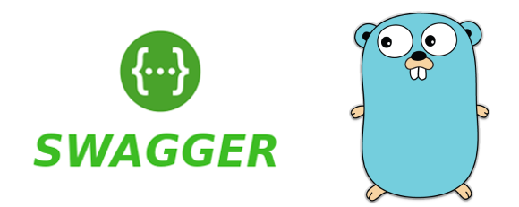
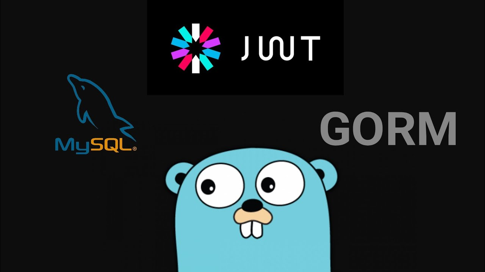
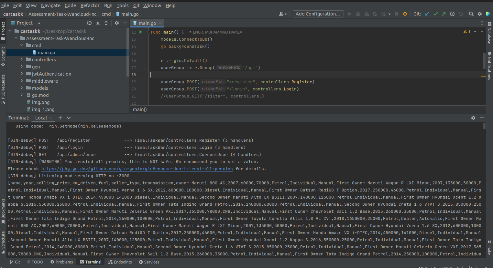
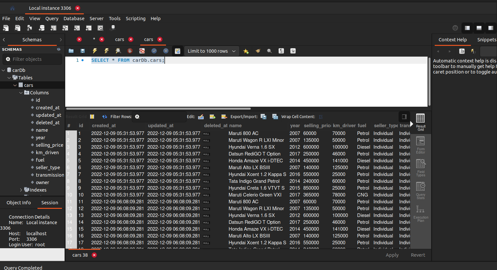
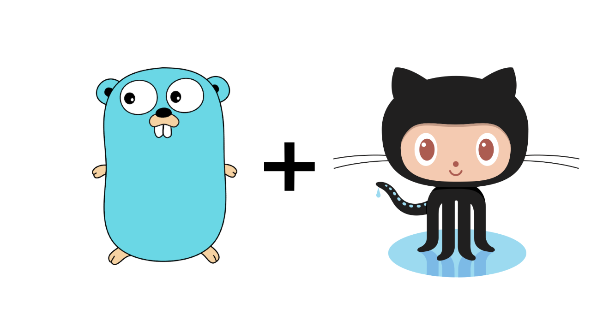

# Generate Reports On Cars - GoSwagger

# Description:
1. ****SignUp** and **Login** Functionality:**

   A user will be able to register into the
   application, and a registered user will be able to login to the application.
2. **Periodic Sync of Dataset:**

   Using the URL, https://www.kaggle.com/datasets/nehalbirla/vehicle-dataset-from-cardekho
3. 
   it makes the automated to
   retrieve and store data into a local relational database. This operation should be
   performed as a background task,using **Golang Concurrency** 
3. **Search Functionality:**
 
   An API call to get the reports generated. This
   API should be able to filter the result and retrieve the reports based on date. For
   this use case, a user should be able to query the car dataset based on make
   model and make year.
4. **Schema Validation:** 

   The APIs should be able to properly validate input/output
   schemas.
# Development
## Create Go REST API with JWT Authentication in Gin Framework

### Simple REST API Design
Created 2 endpoints that will be used as authentication and 1 protected endpoint that will be protected by our JWT
#### Register
This route is to register our login information, so it can be verified.
#### Login
This route will be used to authenticate the user by providing a "email" and "password" then generate and gives JSON Web Token in return
##### Creating Endpoints Of Application
####  Register Endpoint
Creating our controller file that will contain our logic for the registration process.
#### Validation
Validate inputs that are coming into our register endpoint, the input we will need are name email and password.
Using a validation feature that comes with gin which is called binding.

#### Login Endpoint
Login endpoint going to do is very simple, it will receive a email and username, check whether it matches the credential in our database, if it does return a token, if it doesn’t return an error response.
#### Database Connection and Model
To save our credentials in our database, we need to create a database connection to our desired database, I will be using MySQL database that is already installed in my system.
#### Creating .env file
Add variables into .env file
which is API_SECRET

API_SECRET is your own secret string for signing the token
#### Creating JWT Authentication Middleware
To authenticate a user, a client application must send a JSON Web Token (JWT) in the authorization header of the HTTP request to your backend API. API Gateway validates the token on behalf of your API, so you don't have to add any code in your API to process the authentication
#### Using the URL provided above, 
makes it automated to retrieve and store data into a local relational database.


#### Store the car data into Database



#### Getting Started :
**How to Install and Run the Application**

Copy this command

git clone https://github.com/HamzaRogers10/Assessment-Task-Wanclouds-Inc.git

**Create Database** 

The database name must be match with your environment
#### Packages
The list of packages that we will need to install for this application.

**Copy this to install packages.**
```
go get -u github.com/gin-gonic/gin
go get -u github.com/jinzhu/gorm
go get -u github.com/dgrijalva/jwt-go
go get -u github.com/joho/godotenv
go get -u golang.org/x/crypto
```
#### To run this application
Simply copy this command 
```
go run cmd/main.go
```
# Good Luck!
